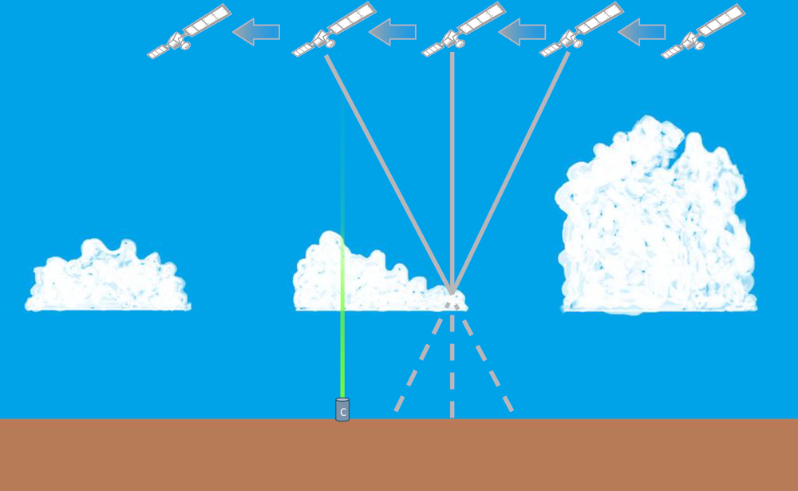

# Long Distance Cloud Measurement Through Stereo Vision
## An European Astro Pi Challenge Proyect
## by Centauri's Team

#### What is our experiment idea?
Clouds have been included in several studies about climate models. Clouds’ warming effect may be strongly amplified or slightly dampened based on their type and height.
The main objective of this experiment is to use “stereo-vision” to calculate the height of clouds.

#### How will we use the Astro Pi computers to perform our experiment?
To carry out our experiment we will use the Astro Pi visible camera to take visible pictures of Earth.
With two of these photos properly separated in time we can perform the calculations to measure the height of the measured objects, clouds or Earth surface.
We will also track the real ISS speed to make the necessary calculations as well as the current height to compare with the data obtained.
